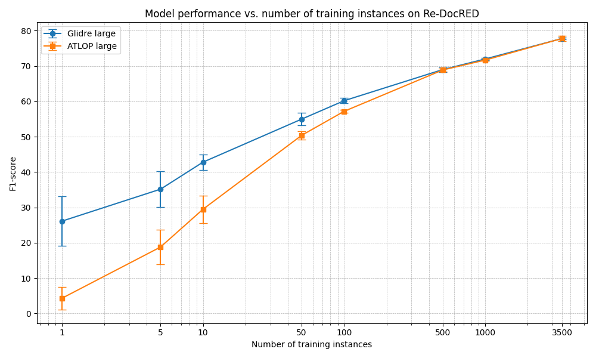

<p align="center"> </p>

# GLiDRE: Generalist and Lightweight Model for Document Relation Extraction
## Overview
GLiDRE is a generalist and lightweight model designed for Document Relation Extraction. It enables users to extract and classify relationships among entities within unstructured text documents. Built upon the success of previous work [GLiNER](https://github.com/urchade/GLiNER).

## Key Features
- **Zero-Shot Extraction:** Capable of classifying unseen relations directly from text.
- **Versatile Input Handling:** Compatible with both tokenized text and full documents.
- **Customizable Architecture:** Supports multiple loss functions and allows easy modification of model components.

## Installation

Install GLiDRE
```bash
pip install .
```

## Quick Start

Here's a simple Python example to get you started:
```python
from glidre import GLiDRE

model = GLiDRE.from_pretrained("cea-list-ia/glidre_large")

text = "The Loud Tour was the fourth overall and third world concert tour by Barbadian recording artist Rihanna."

# Define relation labels
labels = ["COUNTRY_OF_CITIZENSHIP", "PUBLICATION_DATE", "PART_OF"] # Labels are uppercase because the model performs better with capitalized relation names
# Define entity mentions (format: [{"id" : id, "type" : type, "mentions" : [{"value" : text, "start" : start_idx, "end" : end_idx}]}])
mentions = [{
                "id": 0,
                "mentions": [
                    {
                        "value": "Barbadian",
                        "start": 69,
                        "end": 78
                    }
                ],
                "type": "LOC"
            },
            {
                "id": 1,
                "mentions": [
                    {
                        "value": "Rihanna",
                        "start": 96,
                        "end": 103
                    }
                ],
                "type": "PER"}]

# Predict relations using GLiDRE
relations = model.predict_entities(text = text, labels = labels, mentions = mentions, threshold=0.3, multi_label = False)
print("Predicted Relations:")
for relation in relations:
    print(relation["entity_1"])
    print("Label :",  relation["relation_type"])
    print(relation["entity_2"])
    print("---")
```

## Training

GLiDRE supports training on various datasets such as DocRED and Re-DocRED.
```bash
# For Re-DocRED:
python3 train.py --config configs/config_finetuning.yaml
```

## Model performance

<p align="center"> </p>

## Citation

```bibtex
@misc{armingaud2025glidregeneralistlightweightmodel,
      title={GLiDRE: Generalist Lightweight model for Document-level Relation Extraction}, 
      author={Robin Armingaud and Romaric Besançon},
      year={2025},
      eprint={2508.00757},
      archivePrefix={arXiv},
      primaryClass={cs.CL},
      url={https://arxiv.org/abs/2508.00757}, 
}
```